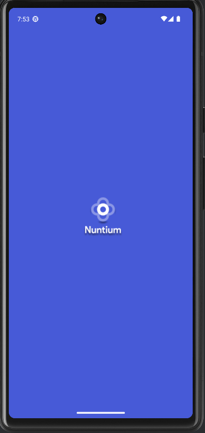

# Nuntium news app

Hi! I have built this simple news app called **Nuntium** to apply the knowledge that I got from Google intro course  [Android Basics with Compose](https://developer.android.com/courses/android-basics-compose/course).

[Android Basics with Compose](https://developer.android.com/courses/android-basics-compose/course) is a self-paced, online course on how to build Android apps using the latest best practices. It covers the basics of building apps with Jetpack Compose, the recommended toolkit for building user interfaces on Android.

The UI credit goes to [FreebieFlux](https://freebieflux.com/)  - Project [on figma](https://www.figma.com/file/qNiGRGxZOsk9VXe2to3O6H/nuntium-news-app?type=design&node-id=29-3&mode=design)

##  Architecture

* [Guide to app architecture](https://developer.android.com/jetpack/docs/guide) - MVVM
* [Kotlin](https://developer.android.com/kotlin) - 100%
* [Jetpack Compose](https://developer.android.com/jetpack/compose) -  Build better apps faster with  Jetpack Compose

##  Libraries

* Navigation
	* [Compose Navigation](https://developer.android.com/guide/navigation/get-started) - Android Jetpack's Navigation component helps you implement navigation, from simple button clicks to more complex patterns, such as app bars and the navigation drawer.
* Retrofit
    * [Retrofit](https://square.github.io/retrofit/) -  A type-safe  HTTP client  for Android
* Room
    * [Room](https://developer.android.com/training/data-storage/room) - Save data in a local database using Room
* Hilt
    * [Dependency injection with Hilt](https://developer.android.com/training/dependency-injection/hilt-android)  - Hilt is a dependency injection library for Android that reduces the boilerplate of doing manual dependency injection in your project.
    * [Hilt](https://dagger.dev/hilt/#:~:text=Hilt%20provides%20a%20standard%20way,and%20code%20sharing%20between%20apps.) - Hilt provides a standard way to incorporate Dagger dependency injection into an Android application.
*  WorkManager
	* [WorkManager](https://developer.android.com/guide/background/persistent/getting-started) - is the recommended solution for persistent work. Work is persistent when it remains scheduled through app restarts and system reboots.
	
* Datastore
	* [DatasStore](https://developer.android.com/topic/libraries/architecture/datastore) - Jetpack DataStore is a data storage solution that allows you to store key-value pairs or typed objects with protocol buffers.

* Coil
    * [Coil Compose](https://coil-kt.github.io/coil/) - An image loading library for Android backed by Kotlin Coroutines.
* Other
    * [Gson](https://github.com/google/gson) - A Java serialization/deserialization library to convert Java Objects into JSON and back
    ## Screens

| Splash screen | Home Screen | Favorite screen | Detail screen |
|--|--|--|--|
|  |  |  |   |
